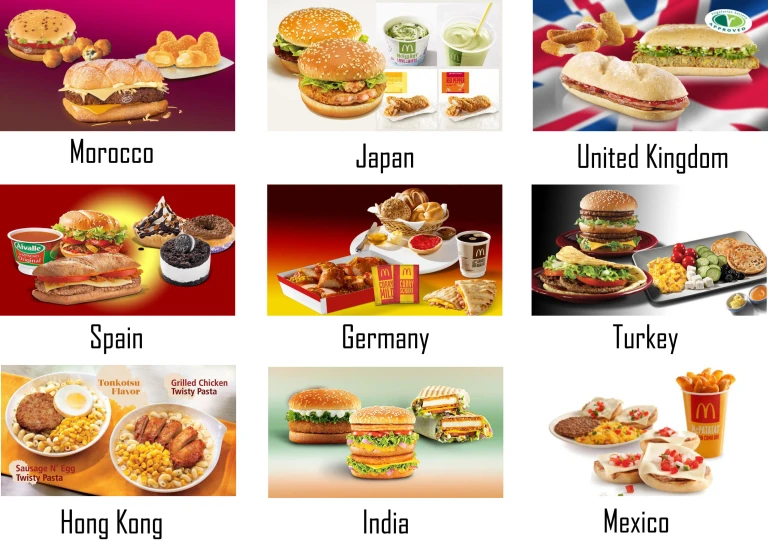

# Internalización y Localización
by Yigo

---
## Tabla de contenidos
* Conceptos básicos
* Como funciona
* Flujo de trabajo
* demo
* Trabajo futuro
---
## Conceptos básicos
---
* **Localización (l10n)**: diseñar y construir un producto **para que pueda adaptarse** a distintas culturas, paises y regiones.
---
**Localizacion de un texto**


---
**Localizacion de una fecha**


---
* **Internacionalización (i18n)**: permitir una **facil localización** de un producto.
---
**Cual locale ocupar?**


---
* **Tropicalización**: Adaptar un producto para que sea **aceptado por distintos paises**, regiones oculturas.
---


---
locale vs country


---
## Mentalidad (1)
Internacionalización es un una preferencia del usuario.

---
## Mentalidad (2)
Internacionalización es un proceso que agrega esfuerzo al diseño y desarrollo de un producto.\

---
## Mision
Hacer que el proceso sea lo mas sencillo posible.

---
# Como funciona
---


---
# Flujo de trabajo
(recomendado)

---

1. Diseño y Productro entrega diseño con observaciones de localization, ex: **textos**, fechas, monedas, etc.


---

2. Durante el desarrollo los Developers crean todas llaves unicas de traduccion en el servicio de traducciones. con o sin valores localizados.


---
3. Developer actualiza diccionarios locales

```bash
npm run translations
```
---
3. Developer ocupa las llaves de traduccion en su codigo
```js
import { useTranslation } from 'react-i18next';
const { t } = useTranslation(['rent.landing'])
function MyComponent() {
  return (
    ...
    {t("search.rent.welcome.text", { ns: 'rent.landing'})}
    ...
  )
}
```
---
4. Diseño y Productro puede editar cuanto quiera los valores de los textos en el servicio de traducciones.


---

4. Cuando la feature este lista para pasar a prod, el build se encargara de generar los diccionarios.

---
## Consideraciones

* dev, staging y prod ocupan el mismo servicio de traducciones. cms.houm.com
* cms-staging es para desarrollar nuevas features de gestion de contenido. cms-staging no es para probar traducciones.
* si se necesitan actualizar los diccionarios se puede hacer gatillar un build en github workflow.
---
## demo
---
## Trabajo futuro
* integrar translations manager en backend
* manejar texto con variables (ex: "Hola {name}")
* otros?